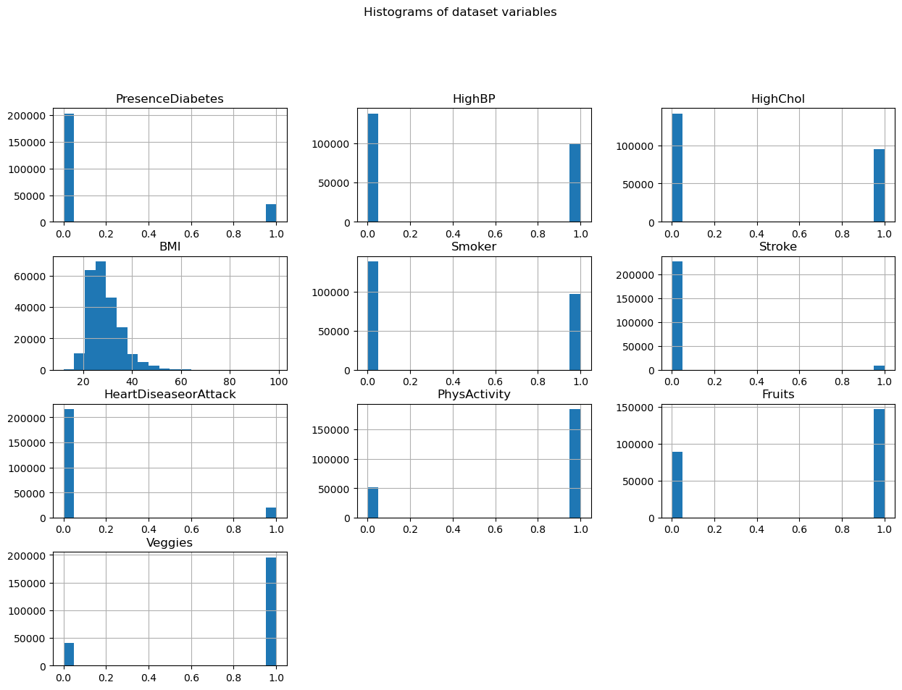
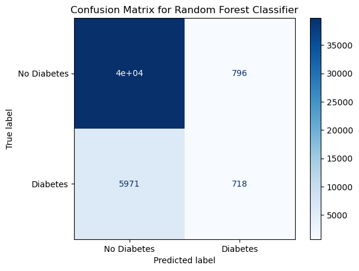
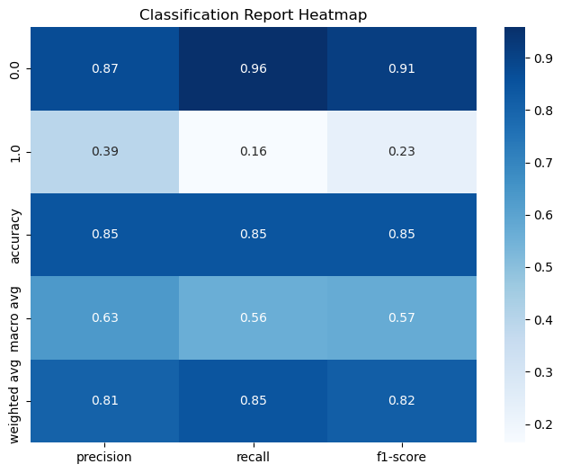

# <center>Health Indicators and their relationshp to having Diabetes</center>
<center>By: Casey Cruz</center> 

---

## Introduction
> Diabetes is a chronic medical condition that affects how the body creates energy from food. The food consumed is broken down into sugar, which is released into the bloodstream. When this happens, blood sugar levels go up, but the pancreas releases insulin to stabilize it. If a person has diabetes, their body cannot regulate blood sugar levels through the use of insulin as well as someone without diabetes. This results in too much blood sugar remaining in the bloodstream and can cause serious health concerns..
  
> In the U.S., there are around 38 million adults who have diabetes. It is the 8th leading cause of death in the U.S. and the number 1 cause of kidney failure, lower-limb amputation, and adult blindness. The number of adults diagnosed with diabetes has doubled in the last twenty years, which is a major problem.

>For this project, the dataset that will be used is from the Behavioral Risk Factor Surveillance System (BRFSS), which collects data on health-related risk behaviors and chronic health conditions. The specific dataset that will be analyzed contains data on whether a person has no diabetes or has diabetes/prediabetes and health indicators that they have or do not have. Examples of the indicators are high blood pressure and high cholesterol. This data can be used to understand the health indicators that relate to someone having diabetes. With that, information on general preventative measures can be identified and released to the public to show them which things are important to reduce their chances of having diabetes.

## How to use the Data Science Pipeline to Analyze Data
> When working with data, there are four main aspects that are used: <font color=green>data collection</font>, <font color=green>data storage</font>, <font color=green>data analysis</font>, and <font color=green>data visualization</font>. Data collection is the process of gathering raw information from various sources, which can be done through web scraping. Data storage involves organizing, cleaning, and storing the data in a structured format that allows for easy retrieval and analysis. Data analysis is where stored data is transformed and manipulated to extract meaningful insights. Data presentation involves communicating the results of data analysis in a clear and understandable manner, often done through visualizations.

---

### Objective
>In this project, the overall objective will be to create a classification algorithm to predict if there is a presence of diabetes based on health indicators. Python will be the programming language used.

---

## <font color = green>Data Collection</font>
>The data that will be analyzed has already been collected. However, it is important to understand data collection, as it is the first step in the data science pipeline, so an example will be run through.

>Data collection is the process of gathering raw information from sources and can be performed through web scraping. Web scraping is the process of extracting information or data from websites. In this example, we will be extracting data from https://www.cnn.com.

>Here, we can observe the steps of web scraping. The first step is to make a request to the site to access and then parse the HTML code of the site. We extract the article references and then request and parse their HTML code with BeautifulSoup. The article title gets extracted and printed. The collected data can then be saved, processed, or used for analysis. <font color = red>Follow along with comments in the code!</font>


```python
#Import necessary libraries
import requests #for making requests for a websites data
import re #regular expressions, a way to parse HTML
from bs4 import BeautifulSoup #for web scraping

#Retrieve HTML text from the initial URL
initialSite = "https://www.cnn.com"
getHTML = requests.get(initialSite)
siteHTML = getHTML.text

#Find all article links from the HTML
allArticles = re.findall(r'<a href="(/[^"]+)"', siteHTML)

#Filter out video links and duplicates & keep the top articles
topArticles = []
for newArticle in allArticles:
    if newArticle not in topArticles and "video" not in newArticle:
        topArticles.append(newArticle)
        
topArticles = topArticles[:5]
    
#Initialize lists to store article titles and word counts
titles = [] 
       
#Iterate through the chosen article links
for articleLink in topArticles:
    if "live-news" in articleLink:
        articleURL = f"{initialSite}/{articleLink}"
    else:
        articleURL = f"{initialSite}{articleLink}"

    #Retrieve HTML text for the article
    txt = requests.get(articleURL)
    articleHTML = txt.text
    
    #Check if access is denied
    if "Access to this page has been denied" in articleHTML: continue  # Skip this article
    
    # Find the title of the article & print
    soup = BeautifulSoup(articleHTML, 'html.parser')  # Initialize BeautifulSoup for web scraping
    for title in soup.find('title'):  # Find title
        print("-", title.get_text())
```

    - Live updates: Israel-Hamas war intensifies, Gaza humanitarian crisis worsens | CNN
    - Geminid meteor shower set to peak this week | CNN
    - Tesla recalls 2 million vehicles to limit use of Autopilot feature after nearly 1,000 crashes | CNN Business
    - Manchester United’s disastrous season plumbs new depths following meek Champions League exit | CNN


#### Data Ethics
> Web scraping can be a powerful tool, but it should be used responsibly and ethically. Some website owners may include terms of service that prohibit or restrict scraping, and other websites may employ measures to prevent or limit access. It is crucial to be aware of these legal considerations when performing web scraping and to comply with legal guidelines, be transparent, and obtain informed consent. Additionally, there are many ethical aspects to consider. Given that the integrity and reliability of data are so important, when data collection is flawed or conducted poorly, the resulting dataset may not accurately reflect the targeted characteristics of the data. Examples of these flaws include incomplete data and skewed survey questions, which can introduce biases during data collection. These biases may lead to misinterpretation or the reinforcement of existing biases. That is why it is important to consider data ethics when collecting data and to avoid this by being fair in data collection and minimizing biases.

## <font color = green>Data Storage</font>
> The next step in the data science pipeline is data storage. This involves organizing, cleaning, and storing the data in a structured format. When we store the data, there are four main irregularities we look for: missing data, unnecessary data, irrelevant data, and inconsistent data. Missing data refers to absent values, which can be resolved by either inputting a value or removing the data. Unnecessary data refers to non-essential information for the goals of an analysis, and this can be resolved by excluding certain data. Irrelevant data refers to information that has no meaningful impact on the analysis, and this can be resolved by fully removing the data. Inconsistent data refers to information that does not follow a uniform format across the dataset, and this can be due to certain characters, numbers, or HTML-specific code. It can be resolved through parsing. The pandas library has many built-in tools that can be used to remove these irregularities, and they will be used in the example. 

>Our dataset has already been assembled in a readable fashion, so there is no missing, irrelevant, or inconsistent data included. However, it does contain unnecessary data that will need to be removed. First, we need to begin by reading our data, which is in a CSV file. <font color = red>Follow along with comments in the code!</font>


```python
#Import the pandas library for data manipulation and analysis
import pandas as pd

#File path to the CSV file
csvfile = 'diabetes_binary_health_indicators_BRFSS2021.csv'

#Read the CSV file into a pandas DataFrame
df = pd.read_csv(csvfile)

#Print the column titles
column_titles = df.columns
print(column_titles)
```

    Index(['Diabetes_binary', 'HighBP', 'HighChol', 'CholCheck', 'BMI', 'Smoker',
           'Stroke', 'HeartDiseaseorAttack', 'PhysActivity', 'Fruits', 'Veggies',
           'HvyAlcoholConsump', 'AnyHealthcare', 'NoDocbcCost', 'GenHlth',
           'MentHlth', 'PhysHlth', 'DiffWalk', 'Sex', 'Age', 'Education',
           'Income'],
          dtype='object')


### Data Cleaning
>The next step in data storage is cleaning and modifying the data to be easily readable/manipulated. When this is done, it is important to keep in mind the objectives so that the most beneficial information for the analysis is extracted. This analysis will create a classification algorithm to predict if there is a presence of diabetes based on certain health indicators. The variables we want to analyze relate mainly to physical health conditions, so certain categories can be dropped from the data frame. <br><br>We are going to remove 'CholCheck', 'HvyAlcoholConsump', 'AnyHealthcare', 'NoDocbcCost', 'GenHlth', 'MentHlth', 'PhysHlth', 'DiffWalk', 'Sex', 'Age', 'Education', and 'Income'. These are unnecessary data.


```python
#column names intended to be remove from the DataFrame
columnsToRemove = ['CholCheck', 'HvyAlcoholConsump', 'AnyHealthcare', 'NoDocbcCost', 'GenHlth', 'MentHlth', 'PhysHlth', 'DiffWalk', 'Sex', 'Age','Education', 'Income']

#Remove specified columns
df.drop(columns=columnsToRemove, errors='ignore', inplace=True)

#Edit name for clarity
df.rename(columns={'Diabetes_binary': 'PresenceDiabetes'}, inplace=True)

#print new structure
print(df.head())
```

       PresenceDiabetes  HighBP  HighChol   BMI  Smoker  Stroke  \
    0               0.0       0       1.0  15.0     1.0     0.0   
    1               1.0       1       0.0  28.0     0.0     0.0   
    2               1.0       1       1.0  33.0     0.0     0.0   
    3               1.0       0       1.0  29.0     0.0     1.0   
    4               0.0       0       0.0  24.0     1.0     0.0   
    
       HeartDiseaseorAttack  PhysActivity  Fruits  Veggies  
    0                   0.0             0       1        1  
    1                   1.0             0       1        0  
    2                   0.0             1       1        1  
    3                   1.0             1       1        1  
    4                   0.0             0       0        0  


> Our dataset includes the following variables: Presence of Diabetes, High Blood Pressure (HighBP), High Cholesterol (HighChol), Body Mass Index (BMI), Smoking status (Smoker), History of Stroke, History of Heart Disease or Heart Attack, Engagement in Physical Activity (PhysActivity), Consumption of Fruits, and Consumption of Vegetables. All variables, except for BMI, are binary, where 0 signifies the absence of the health indicator, and 1 signifies its presence. For BMI, the scale categorizes individuals as underweight (<18.5), normal weight (18.5–24.9), overweight (25–29.9), and obesity (30 or greater). Now, the data has been stored in a way that we can manipulate it. 

## <font color = green>Data Analysis</font>
> The next step in the data science pipeline is data analysis. This is where stored data is transformed and manipulated to extract meaningful insights. The objective is to create a classification algorithm to predict if there is a presence of diabetes based on health indicators. 

>Before the classification is run, it is beneficial to look at the distribution of data. This can help identify if there is an imbalance in the distribution, which can affect the performance of the classification algorithms, as the model may be biased towards the majority class. It gives you the range and scale of features, which can be crucial. Examining the distribution helps in identifying potential outliers or skewed features that might need preprocessing. Also, it can help decide which classification algorithms will be most suitable. <font color = red>Follow along with comments in the code!</font>


```python
#The matplotlib library is used to create plots and visualizations
import matplotlib.pyplot as plt

#Display histograms for variables to show distribution
numerical_columns = df.select_dtypes(include=['float64', 'int64']).columns #selects numerical columns
df[numerical_columns].hist(bins=20, figsize=(15, 10)) #creates histograms
plt.suptitle('Histograms of dataset variables', y=1.02)
plt.show() #Display the histograms
```


    

    


>When looking at these results, it is clear that our dataset is imbalanced. One of the most notable issues is the imbalance in the "PresenceDiabetes" variable. As previously mentioned, with this imbalance, the model may be biased towards the majority class, which is 0, indicating the absence of diabetes. 
### Classification
>Now the classification can be run. In the classification process, data is preprocessed, defining the features (health indicators) and the target variable (Presence of Diabetes). The dataset is split into training and testing sets for training and evaluating the model. The classification tool to be used is the Random Forest Classifier, an ensemble learning method that constructs multiple decision trees during training and outputs the class that is the mode of the classes of the individual trees. The classifier is then trained and used to make predictions on the test set. The model is evaluated by calculating the accuracy of the predictions.


```python
#Import necessary libraries
from sklearn.model_selection import train_test_split #to split the dataset into training and testing sets
from sklearn.ensemble import RandomForestClassifier #to build a Random Forest model
from sklearn.metrics import accuracy_score, classification_report, confusion_matrix #to calc accuracy, get classification report, and get confusion matrix


#Initialize the features and target variable. 
X = df.drop('PresenceDiabetes', axis=1) #features (health indicators)
y = df['PresenceDiabetes'] #target variable (Presence Diabetes)
    
#Split the data into training and testing sets
xTrain, xTest, yTrain, yTest = train_test_split(X, y, test_size=0.2, random_state=42)

#Initialize the Random Forest Classifier
Rainf = RandomForestClassifier(random_state=42)

#Train model with training data
Rainf.fit(xTrain, yTrain)

#Make predictions on the test set
yPrediction = Rainf.predict(xTest)

#Evaluate the accuracy
accuracy = accuracy_score(yTest, yPrediction)

#Print the accuracy
print(f'Accuracy: {accuracy * 100:.2f}%')
```

    Accuracy: 85.69%


#### Results
> We can see that the accuracy of the classification is 85.69 percent, which is quite good. That means the model correctly predicted 85.69 percent of the values in the PresenceDiabetes column based on the health indicators in the dataset. The remaining data that was incorrectly predicted constitutes a large portion of the dataset, and a deeper evaluation of the analysis can be done to see what improvements might need to be made. This is where we move into data presentation.

## <font color = green>Data Presentation</font>
> The final step in the data science pipeline is data presentation. This is where the results of data analysis are communicated in a clear and understandable manner. This is often done through visualizations. The Python libraries Matplotlib and Seaborn are two very useful tools when it comes to creating visualizations. Two ways to visualize and get a deeper analysis of the classification will be to look at the confusion matrix and the classification report. 

>First, we will start by examining the confusion matrix of the classification. This matrix provides a table that describes the performance of the classification model on a set of data. The table has four cells: True Positive (TP) in the top left, False Positive (FP) in the top right, True Negative (TN) in the bottom right, and False Negative (FN) in the bottom left. These values help in understanding where the model is making errors. <font color = red>Follow along with comments in the code!</font>


```python
import seaborn as sns #for statistical graphics
from sklearn.metrics import confusion_matrix, ConfusionMatrixDisplay #for displaying confusion matrix

#Plot confusion matrix
ConfusionMatrixDisplay(confusion_matrix=confusion_matrix(yTest, yPrediction), display_labels=['No Diabetes', 'Diabetes']).plot(cmap='Blues')
plt.title('Confusion Matrix for Random Forest Classifier')
plt.show()
```


    

    


> From the table, we can see that the True Positives for "No diabetes" were significantly higher than all the other values. This could indicate some bias towards the presence of no diabetes, as it was consistently predicted correctly more than the other classes.

>The next visualization to look at is the classification report. This will show us the precision, recall, and F1-score of the classification. Precision measures how many of the predicted positive instances are actually positive. Recall measures how many of the actual positive instances were correctly predicted. The F1-score provides a balance between precision and recall. The F1-score is useful when the class distribution is imbalanced. The heatmap, which will be used to display this, color-codes the values in each cell, making it easy to identify which classes perform well or poorly for each metric. Brighter colors indicate higher values.


```python
from sklearn.metrics import classification_report #for displaying classification reports

# Visualize the classification report
plt.figure(figsize=(8, 6))
sns.heatmap(pd.DataFrame.from_dict(classification_report(yTest, yPrediction, output_dict=True)).iloc[:-1, :].T, annot=True, cmap='Blues')
plt.title('Classification Report Heatmap')
plt.show()
```


    

    


> From the classification report, it is clear what was successful and what was not. To understand what is going on, the weighted average and macro average can be ignored. The classification was extremely successful in predicting the cases when diabetes was not present. The precision was 87%, the recall was 96%, and the F1-score was 91%, showing there is a good trade-off between precision and recall. On the other hand, the classification was very poor at predicting the cases when diabetes was present. The precision was 39%, the recall was 16%, and the F1-score was 23%, indicating that the model struggles to balance precision and recall. The model is not nearly as good at predicting the presence of diabetes. 

> By using the confusion matrix and classification report together, it can help assess and identify potential areas of improvement in this classification model. From the visualizations of the two, it is clear there is work to do to improve the accuracy of the classification, specifically for correctly predicting the presence of diabetes when it is present. This is what was predicted after looking at the distribution of data. There is a clear bias towards predicting the absence of diabetes. This does make sense with how many more entries of the absence of diabetes there were compared to the number of entries with the presence of diabetes.

### Sources
>CDC Diabetes Info <br>www.cdc.gov/diabetes/basics/diabetes.html#:~:text=With%20diabetes%2C%20your%20body%20doesn,vision%20loss%2C%20and%20kidney%20disease

>Dataset <br> https://www.kaggle.com/datasets/julnazz/diabetes-health-indicators-dataset

>Python <br> https://www.python.org
